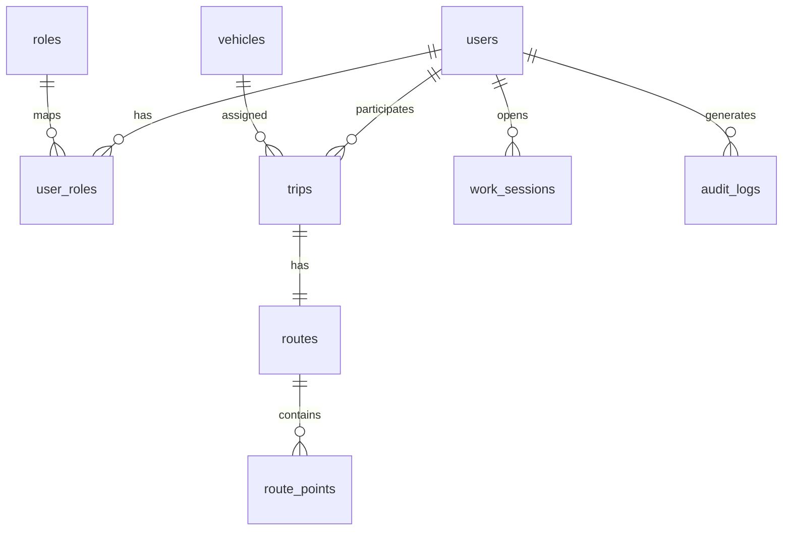

# Схема базы данных (ER)

Ниже — обзор основных сущностей и связей. Детальная структура задаётся Liquibase в `src/main/resources/db/changelog/`.

Для полной картины откройте файлы `0001_init_users_roles.yaml` … `0006_init_audit_logs.yaml` в каталоге changes.
